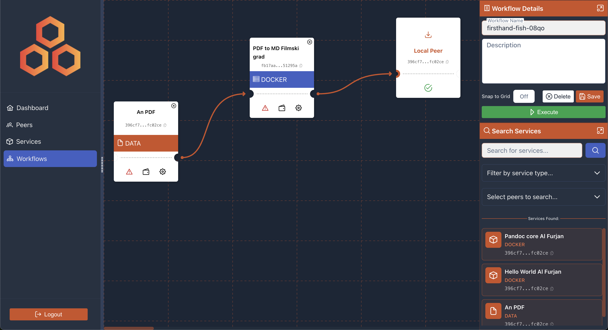
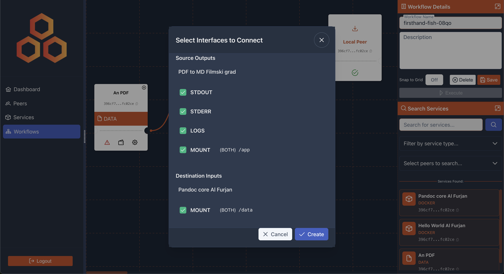
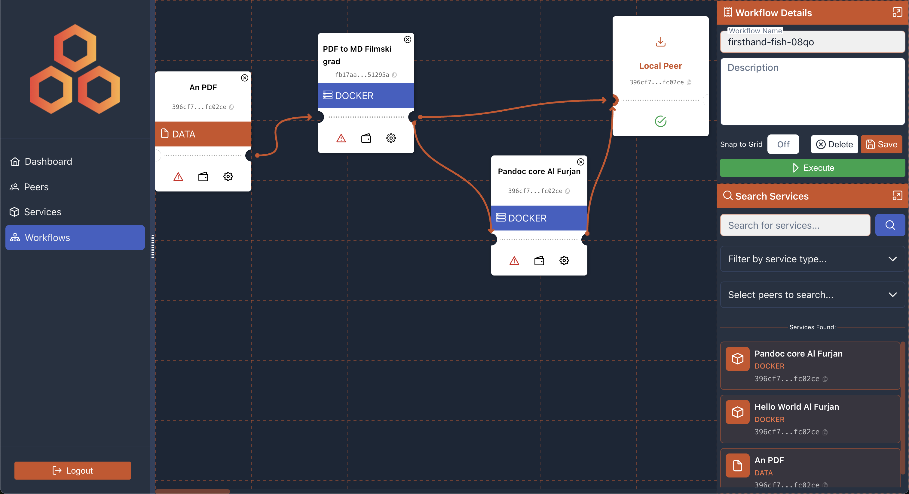

# Remote Network Node

> **Decentralized P2P compute network for trust-based data exchange and secure computation.**

[](https://golang.org)
[](LICENSE)

---

**Remote Network Node** is an open-source, decentralized framework for orchestrating distributed workflows across a peer-to-peer network. It enables secure data exchange and computation using Docker containers and standalone executables, with cryptographic identity verification and NAT-friendly connectivity.

---

## Key Features

### P2P Networking
- **Mainline DHT** - BitTorrent DHT with BEP_44 mutable data for decentralized peer discovery and metadata storage
- **Ed25519 Cryptography** - Secure peer identity with public key signatures
- **NAT-Friendly Architecture** - Relay-based connections, hole punching, and QUIC transport
- **Custom Gossip Protocol** - Efficient peer-to-peer message propagation

### Payment System
- **x402 Payment Protocol** - Decentralized payment system for service compensation
- **Multi-Chain Support** - Ethereum (Base), Solana, and other EVM chains
- **Cryptocurrency Wallets** - Encrypted wallet management via CLI and Web UI
- **P2P Invoice Payments** - Direct payment requests between peers
- **Escrow Management** - Secure payment holding with automatic settlement

### Workflow Orchestration
- **Visual Workflow Designer** - Web UI for creating and managing distributed workflows
- **Service Registry** - Publish and discover services across the network
- **Job Execution Engine** - Coordinate multi-step workflows across peers
- **Interface System** - Flexible I/O interfaces (STDIN, STDOUT, STDERR, LOGS, MOUNT)

### Container Runtime
- **Docker Integration** - Pull images from registries, build from Git repos or local Dockerfiles
- **Automatic Interface Detection** - Detect container interfaces from image metadata
- **Mount Support** - Bidirectional file exchange via container mount points
- **Execution Monitoring** - Real-time output streaming via WebSocket

### Security
- **End-to-End Encryption** - QUIC-based encrypted connections
- **Signed Metadata** - BEP_44 ensures tamper-proof peer metadata
- **Job Verification** - Cryptographic verification of job execution results
- **Payment Signatures** - Cryptographic proof of payment authorization

---

## Visual Workflow Designer

The web-based workflow designer provides an intuitive drag-and-drop interface for creating distributed compute workflows:







---

## Architecture

```
┌─────────────────────────────────────────────────────────────────┐
│                         Web UI (Vue.js)                         │
├─────────────────────────────────────────────────────────────────┤
│                         REST API + WebSocket                     │
├───────────────┬───────────────┬───────────────┬─────────────────┤
│   Workflow    │     Job       │    Service    │      Peer       │
│   Manager     │   Manager     │   Registry    │    Discovery    │
├───────────────┴───────────────┴───────────────┴─────────────────┤
│                       Data Worker (Transfers)                    │
├─────────────────────────────────────────────────────────────────┤
│   Docker Service   │   QUIC Transport   │   Relay Manager       │
├────────────────────┴───────────────────┴────────────────────────┤
│                     Mainline DHT (BEP_44)                        │
└─────────────────────────────────────────────────────────────────┘
```

### Workflow Execution Flow

```
1. Create Services     → Register Docker containers as network services
2. Design Workflow     → Connect services via visual workflow designer
3. Start Execution     → Orchestrator distributes jobs to executor peers
4. Data Transfer       → Outputs flow between jobs via secure channels
5. Collect Results     → Final outputs delivered to requesting peer
```

### Interface Types

| Interface | Direction | Description |
|-----------|-----------|-------------|
| STDIN     | Input     | Stream data to container's standard input |
| STDOUT    | Output    | Capture container's standard output |
| STDERR    | Output    | Capture container's error output |
| LOGS      | Output    | Combined container logs with timestamps |
| MOUNT     | Both      | File-based I/O via container mount points |

---

## Getting Started

### Prerequisites

- Go 1.24+
- Docker (automatically installed if missing)

### Supported Platforms

The following platforms are supported and tested:
- **Linux**: Debian, Ubuntu
- **Windows**: Windows 10/11
- **macOS**: Darwin (Mac OS X)

### Installation

```bash
git clone https://github.com/Trustflow-Network-Labs/remote-network-node.git
cd remote-network-node

# Build
go build -o remote-network ./
```

### Running

```bash
# Start the node
./remote-network start

# Start node as a relay (for public IP nodes that can relay traffic for NAT-ed peers)
./remote-network start -r
```

### Set Up and Access the Web UI

The Web UI is a separate Vue 3 application located in `ui/web/frontend/` directory. It requires Node.js 18+ and must be set up independently.

#### Install Node.js (if not installed)

```bash
# Using NodeSource repository
curl -fsSL https://deb.nodesource.com/setup_lts.x | sudo -E bash -
sudo apt install -y nodejs

# Verify installation
node --version  # Should be 18.x or higher
```

#### Install Web UI Dependencies

```bash
# Navigate to the web UI directory
cd ui/web/frontend

# Install dependencies
npm install
```

#### Run Web UI - Option 1: Development Mode

```bash
# Start development server (with hot reload)
npm run dev

# The UI will be available at http://localhost:5173
```

**Configure Node Endpoint:** When you open the Web UI login page, enter `https://localhost:30069` in the "Node Endpoint" field if it's not already set. This tells the UI where to find your running node's API server.

#### Run Web UI - Option 2: Production Build

```bash
# Build for production
npm run build

# Install a static file server (one-time setup)
npm install -g http-server

# Serve the built files on port 8080 (avoid port 30069 - used by API server)
http-server dist -p 8080

# Access at http://localhost:8080
```

**Quick Access:** After the node is running and the Web UI is served, navigate to `http://localhost:8080` (production build) or `http://localhost:5173` (development mode). You'll need to export your private key to authenticate (see Key Management section).

### Key Management

```bash
# View key information
./remote-network key info

# Export private key for web UI authentication
./remote-network key export --format binary

# Export as hex format
./remote-network key export --format hex --output /path/to/key.txt
```

---

## Project Structure

| Directory | Purpose |
|-----------|---------|
| `cmd/` | Application entrypoint and CLI |
| `internal/core/` | Workflow and job management |
| `internal/p2p/` | DHT, QUIC, relay implementations |
| `internal/services/` | Docker service integration |
| `internal/workers/` | Background workers (data transfer) |
| `internal/database/` | SQLite persistence layer |
| `internal/api/` | REST API and WebSocket handlers |
| `web/` | Vue.js frontend application |
| `docs/` | Architecture and protocol documentation |

---

## Documentation

### API Documentation

- [REST API Reference](docs/API_REFERENCE.md) - Complete REST API documentation for all endpoints
- [WebSocket API Reference](docs/WEBSOCKET_API.md) - Real-time WebSocket API with message formats and examples

### Getting Started

- [Docker Service Quickstart](docs/DOCKER_SERVICE_QUICKSTART.md) - Quick guide to deploying Docker services
- [Keystore Setup](docs/KEYSTORE_SETUP.md) - Ed25519 keystore configuration and management

### Payment System

- [Payment System Overview](docs/PAYMENT_SYSTEM_OVERVIEW.md) - Complete payment system guide and quick start
- [Wallet Management](docs/WALLET_MANAGEMENT.md) - Cryptocurrency wallet management (CLI + Web UI)
- [P2P Payments](docs/P2P_PAYMENTS.md) - Peer-to-peer invoice payment system
- [x402 Payment Protocol](docs/X402_PAYMENT_PROTOCOL.md) - Decentralized payment protocol specification

### Architecture & Design

- [Architecture Overview](docs/ARCHITECTURE.md) - Complete system architecture, components, and data flow
- [Relay Connection Architecture](docs/relay-connection-architecture.md) - Relay server design and connection management
- [Verifiable Compute Design](docs/VERIFIABLE_COMPUTE_DESIGN.md) - Trustless job execution verification approaches

### Service Management

- [Standalone Services API](docs/STANDALONE_SERVICES_API.md) - Binary/executable service deployment and execution
- [Docker Dependencies](docs/DOCKER_DEPENDENCIES.md) - Docker dependency management and platform setup
- [Workflow Creation and Execution](docs/workflow-creation-and-execution.md) - Multi-job workflow orchestration

### Communication

- [Chat Messaging](docs/CHAT_MESSAGING.md) - End-to-end encrypted P2P chat (1-on-1 and group chats)

### Networking & P2P

- [Hole Punching Protocol](docs/hole-punching-protocol.md) - NAT traversal and direct peer connections
- [DHT Metadata and Capabilities](docs/dht-metadata-and-capabilities.md) - Peer discovery and capability matching
- [Network State Monitoring](docs/NETWORK_STATE_MONITORING.md) - Network change detection and connection recovery

### Diagrams

- [Protocol Diagrams](docs/diagrams/README.md) - PlantUML diagrams for protocols and flows

---

## Use Cases

### Distributed Data Processing
Process data across multiple peers, each contributing specialized services:
```
Data Source → Preprocessing → ML Inference → Results Aggregation
    (Peer A)     (Peer B)        (Peer C)         (Peer D)
```

### Decentralized File Conversion
Convert files using containerized tools without centralized servers:
```
PDF Document → OCR Service → Text Extraction → Summary Generation
```

### Privacy-Preserving Computation
Execute sensitive computations on remote peers without exposing raw data:
```
Encrypted Input → Secure Compute → Encrypted Output
```

---

## Development Roadmap

### Completed
- **P2P Layer**: Mainline DHT, BEP_44 metadata, QUIC transport
- **NAT Traversal**: Relay servers, hole punching, STUN-like NAT detection
- **Service Registry**: Docker service creation and discovery
- **Workflow Engine**: Visual designer, job orchestration
- **Interface System**: STDIN, STDOUT, STDERR, LOGS, MOUNT, PACKAGE
- **Data Transfer**: Local and remote job output routing
- **Web UI**: Service management, workflow designer, job monitoring
- **Remote Peer Execution**: Job execution across peers
- **Encrypted Data Transfer**: AES-256-GCM encrypted transfers between peers
- **Service Marketplace**: Discovery, capabilities matching, peer metadata storage
- **Standalone Runtime**: Binary/executable service execution (local, Git, upload)
- **Security & Authentication**: Ed25519 signatures, JWT, challenge-response, TLS 1.2+
- **Monitoring & Metrics**: Health endpoints, Prometheus metrics, resource tracking, pprof
- **Git Integration**: Deploy services directly from Git repositories
- **System Capabilities**: Auto-detection and matching of CPU, memory, GPU, Docker, platform
- **Payment Integration**: x402 payment protocol, multi-chain wallets (Base, Solana), P2P invoices, escrow management

### Planned
- Trustless job execution verification
- Reputation and trust scoring
- Conditional service replication

---

## Linux Server Configuration

For optimal QUIC performance on Linux servers:

```bash
# Create sysctl configuration
sudo nano /etc/sysctl.d/90-quic-buffers.conf

# Add content:
net.core.rmem_max=7500000
net.core.rmem_default=2500000
net.core.wmem_max=7500000
net.core.wmem_default=2500000

# Apply settings
sudo sysctl -p /etc/sysctl.d/90-quic-buffers.conf
```

---

## Contributing

Contributions are welcome!

1. Fork this repo
2. Create your feature branch: `git checkout -b my-new-feature`
3. Commit your changes: `git commit -am 'Add some feature'`
4. Push to the branch: `git push origin my-new-feature`
5. Submit a pull request

---

## License

This project is licensed under the MIT License. See the [LICENSE](LICENSE) file for details.

---

## Workflow Examples

- Decentralized data integration for pollinator species management in agroecosystems


- Satellite-based deforestation estimation


---

## Links

- [Issue Tracker](https://github.com/Trustflow-Network-Labs/remote-network-node/issues)
- [Trustflow Network Labs](https://github.com/Trustflow-Network-Labs)
- [Previous Project (trustflow-node)](https://github.com/Trustflow-Network-Labs/trustflow-node)
